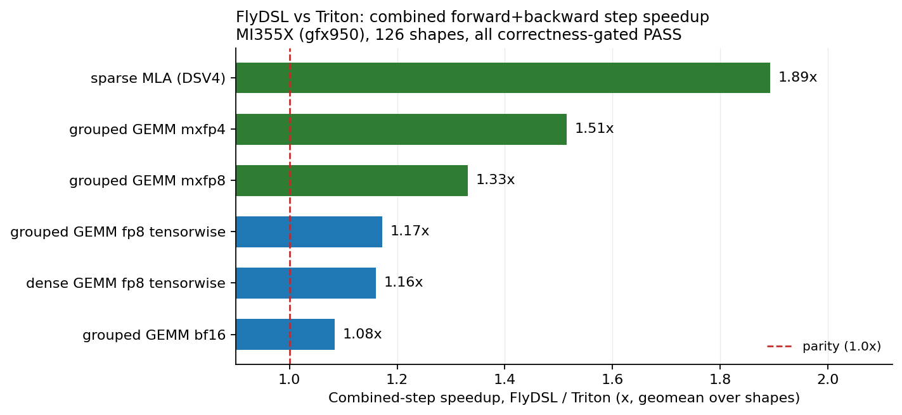
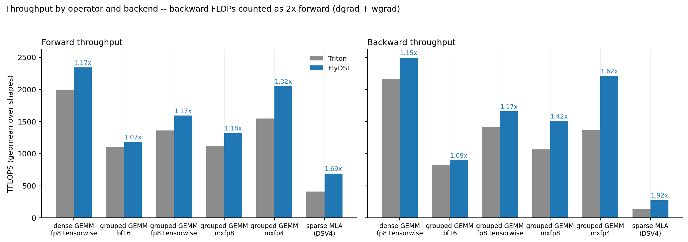
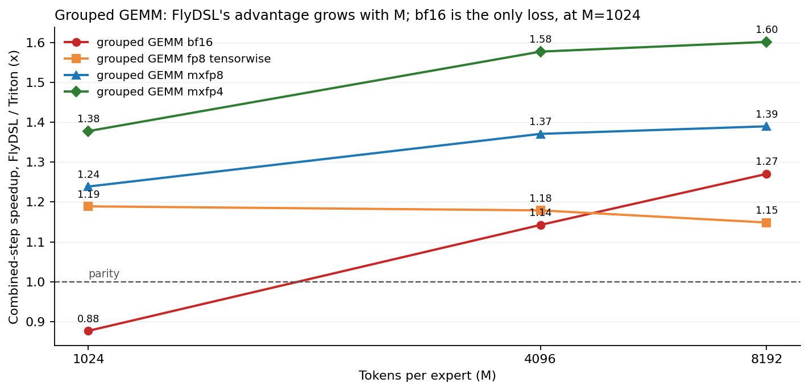

# FlyDSL vs Triton 算子性能对比（6 类算子 / 126 shape）@ MI355X

> **用途**: 在 Primus-Turbo 里横向对比同一算子的 FlyDSL 后端与 Triton 后端，量化 FlyDSL 相对
> Triton 的实际收益，并找出 FlyDSL 仍然落后的形态。
> **When**: 2026-09-03 15:55 UTC+8
> **Where**: `smci355-ccs-aus-n04-25`（MI355X / gfx950 ×8），容器 `xiaoming-dev`（`tasimage/primus:pr-1048`），
> ROCm 7.15 / torch 2.12 / Triton 3.7.0，仓库 `/perf_apps/xiaoming/MegaMoE` @ `ed8d7af4`（用 `PYTHONPATH`
> 指向仓库，绕开 site-packages 里 8/27 的旧安装包 0.4.1.dev33）。
> **Campaign**: `MegaMoE/agent/workspace/triton_vs_flydsl_gfx950_20260903/`，脚本与原始 CSV 已归档到
> `assets/2026-09-03_flydsl_vs_triton/`。

---

## TL;DR

FlyDSL 在全部 6 类可对比算子上都快于 Triton，**combined-step（前向+反向）几何平均加速 1.08x–1.89x**。
收益随量化位宽下降而放大：bf16 grouped GEMM 1.08x，fp8 tensorwise 1.16–1.17x，mxfp8 1.33x，mxfp4 1.51x，
sparse MLA 1.89x。唯一的回退点是 **bf16 grouped GEMM 在 M=1024 时 FlyDSL 慢 12%（0.88x）**，M≥4096 后反超。

一个次要但重要的发现：`ops/grouped_gemm.py` 对 `len(group_lens)==1` 有硬编码短路，直接走 hipBLASLt 稠密
GEMM，**两个后端都不会被调用**。Mixtral-8x22B（8 专家 / EP8 → B=1）的 12 行数据因此无效，已从统计中剔除。

## Background

Primus-Turbo 的算子通过 `AutoKernelDispatcher` 做后端分发，`BackendType` 里同时存在 `TRITON` 和 `FLYDSL`。
此前只有 e2e MoE 流水线级别的后端对比（`notes/moe_perf/turbo/archive_backends/`，Triton/hipBLASLt/CK），
没有算子级的 FlyDSL vs Triton 数据，也不清楚哪些精度组合两边都实现了。

## What I did

### 1. 先枚举合法的对比组合

`probe_backends.py` 对每个 (算子, 精度, 后端) 组合强制指定后端跑一次 fwd+bwd。dispatcher 在
`can_handle` 失败时会 **raise 而不是静默回退**，所以能跑通就等于确认该后端被真正调用。9 个组合 × 2 后端
= 18 次，耗时 6 分 12 秒。结果：

| 配置 | Triton | FlyDSL | 可对比 |
|---|---|---|---|
| dense GEMM fp8 tensorwise | 支持 | 支持 | 是 |
| dense GEMM fp8 rowwise | 支持 | 不支持 | 否 |
| dense GEMM fp8 blockwise | 支持 | 不支持 | 否 |
| dense GEMM mxfp8 | 不支持 | 支持 | 否 |
| grouped GEMM bf16 | 支持 | 支持 | 是 |
| grouped GEMM fp8 tensorwise | 支持 | 支持 | 是 |
| grouped GEMM mxfp8 | 支持 | 支持 | 是 |
| grouped GEMM mxfp4 | 支持 | 支持 | 是 |
| sparse MLA (DSV4) fwd+bwd | 支持 | 支持 | 是 |

FlyDSL 的 fp8 dense 只覆盖 `TENSORWISE` 和 `MX_BLOCKWISE`，Triton 的 fp8 dense 没注册 `MX_BLOCKWISE`，
所以 dense GEMM 只能在 tensorwise 上对齐。

### 2. 统一 bench

现成的 `benchmark/ops/training/bench_grouped_gemm_turbo.py` 只支持 tensorwise/rowwise/blockwise，
mxfp8-grouped、mxfp4-grouped 和 sparse MLA 都没有 bench，所以写了 `bench_triton_vs_flydsl.py`：

- 后端通过 `PRIMUS_TURBO_{GEMM,GROUPED_GEMM,SPARSE_ATTN}_BACKEND` 在**进程启动前**固定，一个进程只测一个后端。
- 正确性先跑再计时，用的是 `benchmark/ops/training/config.py` 的同一套 helper：bf16 用 `check_allclose`，
  fp8 要求 SNR>25 dB，fp4 要求 SNR>10 dB；sparse MLA 用 fp32 gather-softmax 参考实现（按 token 分块）。
- 计时 20 次 warmup + 100 次 `torch.utils.benchmark.Timer`，反向 FLOPs 按前向 2 倍计（dgrad + wgrad）。
- shape 取 `config.py` 网格的代表性子集：4 个 MoE 模型（DeepSeek-V3 / Qwen3-235B-A22B / Mixtral-8x22B /
  Kimi-K2）× 每个模型最大的 2 个 EP × M ∈ {1024, 4096, 8192} × {GateUP, Down}；dense 取 3 个模型 × MBS {1,4}。

`run_all.sh` 把 12 个 (算子 × 后端) 组合按 8 卡分片跑，**每张卡同时只有一个进程**，避免相互干扰计时。
96 个分片任务，总耗时 36 分钟（07:09–07:45 UTC），其中大部分是 FlyDSL 的 MLIR 编译——
`gg_fp8_tw/FLYDSL` 单组 7.5 分钟，而对应的 Triton 只要 23 秒。

396 行计时结果**全部通过正确性门禁**，无 FAIL / ERROR。

## Result

### 总览

| 算子 / 精度 | shape 数 | 前向 Triton | 前向 FlyDSL | 前向比 | 反向 Triton | 反向 FlyDSL | 反向比 | combined step |
|---|---|---|---|---|---|---|---|---|
| dense GEMM fp8 (tensorwise) | 30 | 1999 | 2343 | 1.17x | 2163 | 2497 | 1.15x | **1.16x** |
| grouped GEMM bf16 | 18 | 1104 | 1184 | 1.07x | 828 | 902 | 1.09x | **1.08x** |
| grouped GEMM fp8 (tensorwise) | 24 | 1365 | 1593 | 1.17x | 1418 | 1662 | 1.17x | **1.17x** |
| grouped GEMM mxfp8 | 24 | 1122 | 1323 | 1.18x | 1066 | 1510 | 1.42x | **1.33x** |
| grouped GEMM mxfp4 | 24 | 1551 | 2052 | 1.32x | 1369 | 2212 | 1.62x | **1.51x** |
| sparse MLA (DSV4) | 6 | 410 | 692 | 1.69x | 144 | 277 | 1.92x | **1.89x** |

TFLOPS 为跨 shape 几何平均，加速比为 FlyDSL / Triton。

分布（看有没有被个别 shape 拉动）：

| 算子 / 精度 | shape 数 | 最差 | 中位 | 最好 | FlyDSL 更慢的 shape |
|---|---|---|---|---|---|
| dense GEMM fp8 (tensorwise) | 30 | 1.11x | 1.16x | 1.24x | 0 |
| grouped GEMM bf16 | 18 | 0.84x | 1.14x | 1.63x | 6 |
| grouped GEMM fp8 (tensorwise) | 24 | 1.10x | 1.16x | 1.29x | 0 |
| grouped GEMM mxfp8 | 24 | 1.20x | 1.34x | 1.47x | 0 |
| grouped GEMM mxfp4 | 24 | 1.31x | 1.55x | 1.69x | 0 |
| sparse MLA (DSV4) | 6 | 1.52x | 1.91x | 2.31x | 0 |

除 bf16 外，其余 5 类算子**没有任何一个 shape 上 FlyDSL 更慢**，且最差值都 ≥1.10x，是全域领先而非个别形态取胜。

### 前向 vs 反向

反向是 FlyDSL 优势更明显的一侧，mxfp8（1.42x vs 前向 1.18x）和 mxfp4（1.62x vs 1.32x）尤其突出。
dense fp8 和 grouped fp8 tensorwise 则前后向基本一致（1.15/1.17x）。

### grouped GEMM：加速比随 M 变化

| 每专家 token 数 M | bf16 | fp8 tensorwise | mxfp8 | mxfp4 |
|---|---|---|---|---|
| 1024 | 0.88x | 1.19x | 1.24x | 1.38x |
| 4096 | 1.14x | 1.18x | 1.37x | 1.58x |
| 8192 | 1.27x | 1.15x | 1.39x | 1.60x |

bf16 是唯一随 M 单调变化并穿过 1.0 的曲线。mxfp8 / mxfp4 随 M 增大而变好，fp8 tensorwise 基本平坦。

### bf16 grouped GEMM 全量明细（唯一有回退的算子）

| 模型 / 层 | M | N | K | Triton step (ms) | FlyDSL step (ms) | 加速比 |
|---|---|---|---|---|---|---|
| DeepSeek-V3-Down | 1024 | 7168 | 2048 | 0.98 | 1.16 | 0.84x |
| DeepSeek-V3-GateUP | 1024 | 4096 | 7168 | 1.82 | 2.14 | 0.85x |
| Kimi-K2-Down | 1024 | 7168 | 2048 | 2.82 | 2.96 | 0.95x |
| Kimi-K2-GateUP | 1024 | 4096 | 7168 | 5.29 | 5.96 | 0.89x |
| Qwen3-235B-A22B-Down | 1024 | 4096 | 4096 | 1.07 | 1.27 | 0.84x |
| Qwen3-235B-A22B-GateUP | 1024 | 8192 | 4096 | 2.03 | 2.26 | 0.90x |
| DeepSeek-V3-Down | 4096 | 7168 | 2048 | 5.89 | 5.06 | 1.16x |
| DeepSeek-V3-GateUP | 4096 | 4096 | 7168 | 11.90 | 10.36 | 1.15x |
| Kimi-K2-Down | 4096 | 7168 | 2048 | 4.46 | 3.91 | 1.14x |
| Kimi-K2-GateUP | 4096 | 4096 | 7168 | 8.88 | 7.86 | 1.13x |
| Qwen3-235B-A22B-Down | 4096 | 4096 | 4096 | 3.43 | 3.05 | 1.12x |
| Qwen3-235B-A22B-GateUP | 4096 | 8192 | 4096 | 6.67 | 5.81 | 1.15x |
| DeepSeek-V3-Down | 8192 | 7168 | 2048 | 11.89 | 9.53 | 1.25x |
| DeepSeek-V3-GateUP | 8192 | 4096 | 7168 | 22.49 | 18.24 | 1.23x |
| Kimi-K2-Down | 8192 | 7168 | 2048 | 22.02 | 13.52 | **1.63x** |
| Kimi-K2-GateUP | 8192 | 4096 | 7168 | 35.03 | 28.38 | 1.24x |
| Qwen3-235B-A22B-Down | 8192 | 4096 | 4096 | 3.29 | 2.85 | 1.16x |
| Qwen3-235B-A22B-GateUP | 8192 | 8192 | 4096 | 6.47 | 5.51 | 1.18x |

### sparse MLA（差距最大）

| 变体 | seqlen | 前向 T | 前向 F | 反向 T | 反向 F | Triton step (ms) | FlyDSL step (ms) | 加速比 |
|---|---|---|---|---|---|---|---|---|
| DSV4-flash (H=64) | 1024 | 356 | 531 | 77 | 188 | 1.58 | 0.69 | **2.31x** |
| DSV4-flash (H=64) | 2048 | 420 | 649 | 104 | 257 | 3.94 | 1.70 | **2.31x** |
| DSV4-flash (H=64) | 4096 | 428 | 679 | 123 | 275 | 6.78 | 3.19 | 2.12x |
| DSV4-pro (H=128) | 1024 | 363 | 630 | 169 | 250 | 1.60 | 1.05 | 1.52x |
| DSV4-pro (H=128) | 2048 | 428 | 783 | 223 | 336 | 4.13 | 2.64 | 1.56x |
| DSV4-pro (H=128) | 4096 | 478 | 950 | 245 | 402 | 13.49 | 7.91 | 1.71x |

TFLOPS 单位，反向的绝对值很低（Triton 77–245，FlyDSL 188–402），说明 sparse MLA 反向两边都远离硬件上限，
是后续优化空间最大的一个算子。

## Interpretation

**为什么位宽越低 FlyDSL 赢得越多。** mxfp8 / mxfp4 需要 per-32-element 的 E8M0 scale，主循环里除了 MFMA
还要喂 scale 操作数。FlyDSL 直接用 `mfma_scale_f32_16x16x128_f8f6f4` 并把 scale 预排布成 preshuffle 布局
（`preshuffle_b_scale`），scale 读取融进了 MFMA；Triton 走的是通用 block-scaled 路径，scale 的加载和对齐是
额外指令。位宽越低、scale 密度越高，这个结构性差异越大——mxfp4 反向 1.62x 是全部 GEMM 数据里的最大值。

**为什么反向比前向差距更大。** 反向要跑 dgrad（NN 布局）和 wgrad（变长 K 的分组 GEMM）。wgrad 的 K 随每个
专家的 token 数变化，Triton 的 persistent kernel 需要按最大 K 划分 tile，短专家上会空转；FlyDSL 的
`grouped_gemm_*_variable_k_*` 是按专家切 tile 的，不需要 token 数落在 tile 边界上。这解释了 mxfp8/mxfp4
反向比前向多出 0.24–0.30 的加速比。

**bf16 小 M 的回退是启动/划分开销，不是主循环效率问题。** M=1024 时 FlyDSL 慢 12%，但绝对时间只有
0.98–5.29 ms，其中 DeepSeek-V3-Down（0.98→1.16 ms）差 0.18 ms。同一个 kernel 在 M=8192 上快 25–63%，
说明主循环是好的，损失来自小 M 下 tile 数不足以填满 8 张卡的 CU 以及 per-expert tile 划分的固定开销占比过高。
bf16 grouped GEMM 是最近才加进来的（`ed8d7af4`，PR #486），还没针对小 M 调过，这与预期一致。

**Mixtral 数据无效的教训。** `len(group_lens)==1` 短路是 op 层的正确设计（单专家就是稠密 GEMM，
hipBLASLt 更快），但它让 `PRIMUS_TURBO_GROUPED_GEMM_BACKEND` 完全失效。做后端对比时，
"强制后端 + 跑通" 只能证明 dispatcher 接受了该后端，不能证明 dispatcher 被调用了——B=1 的两组数据
时间完全相同（0.60/0.60、1.16/1.16、6.91/6.91 ms）才暴露了这一点。后续任何后端对比都应该先检查
op 层有没有绕过 dispatcher 的快路径。

**编译时间是 FlyDSL 的实际成本。** FlyDSL 的 MLIR 编译比 Triton 慢一个数量级（`gg_fp8_tw` 全量
7.5 分钟 vs 23 秒）。训练场景下 shape 固定、编译只付一次，可以忽略；但对 shape 频繁变化的场景
（推理变长、autotune 扫描）这是要算进去的。

## Next

- **bf16 grouped GEMM 小 M 调优**：M=1024 的 0.88x 是唯一的回退，而真实训练里每专家 token 数往往比
  1024 更小（DeepSeek-V3 在 T=8192 / topk=8 下平均每专家只有几百 token）。需要把 M 网格往下扩到
  256/512 确认回退是否加深，再决定是否需要小 M 专用 tile 配置。
- **sparse MLA 反向**：反向吞吐两边都只有 77–402 TFLOPS，远低于 MI355X 的 bf16 峰值，即使 FlyDSL 已经
  快 1.92x 也仍有大量余量。这是绝对收益最大的目标，建议按 `kernel-trace-analysis` 抓 ATT 定位瓶颈。
- **补齐覆盖差异**：FlyDSL 的 dense fp8 缺 rowwise/blockwise，Triton 的 dense fp8 缺 mxfp8。前者影响
  FlyDSL 能否作为 dense fp8 的默认后端（Megatron 常用 rowwise）。
- **验证到训练步**：本文是 microbench。按 `iteration_rules` 的要求，收益要在真实训练步上确认——
  下一步用 `benchmark/pretrain/pytorch/` 对 DeepSeek-V3 跑 `GROUPED_GEMM_BACKEND=TRITON` vs `FLYDSL`
  的端到端 step time，确认 1.17–1.51x 的算子收益能落到多少。

## 归档

`assets/2026-09-03_flydsl_vs_triton/`：

| 文件 | 内容 |
|---|---|
| `comparison.csv` | 126 个 shape 的逐 shape 加速比 |
| `tables.txt` | 本文所有表格的原始输出 |
| `probe_backends.py` | 后端合法性枚举 |
| `bench_triton_vs_flydsl.py` | 统一 bench（6 算子 × 2 后端） |
| `run_all.sh` | 8 卡分片驱动 |
| `summarize.py` | 几何平均汇总（含 B=1 剔除逻辑） |
| `make_plots.py` | 三张图的绘制脚本 |

复现：在 `xiaoming-dev` 容器内 `cd` 到 campaign 目录，`bash run_all.sh && python summarize.py`。
